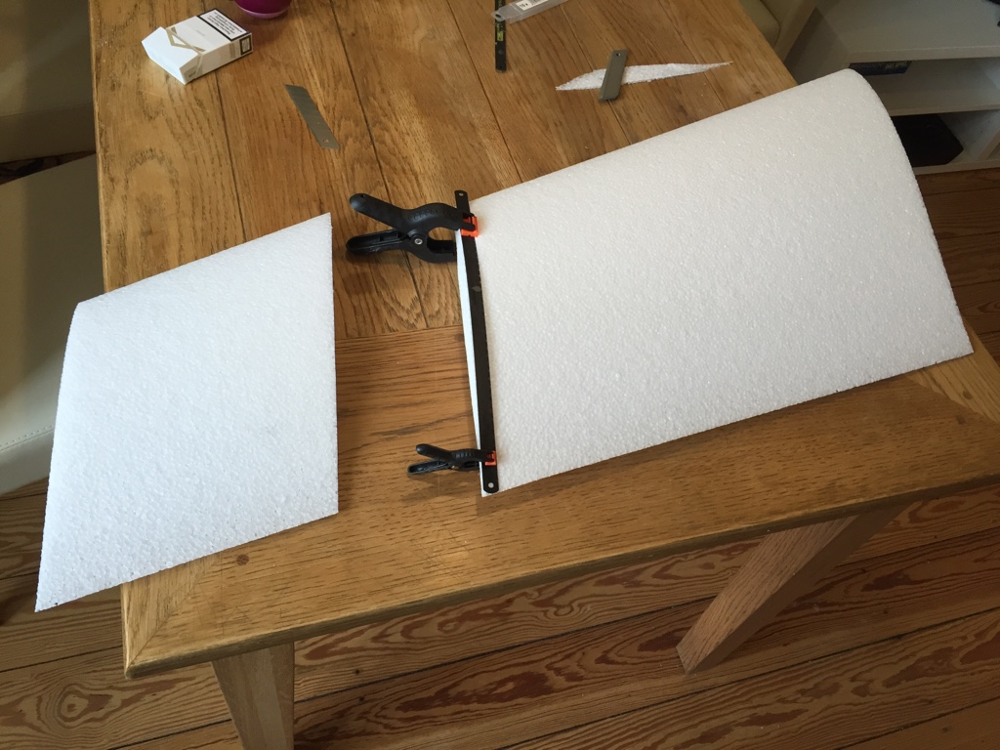
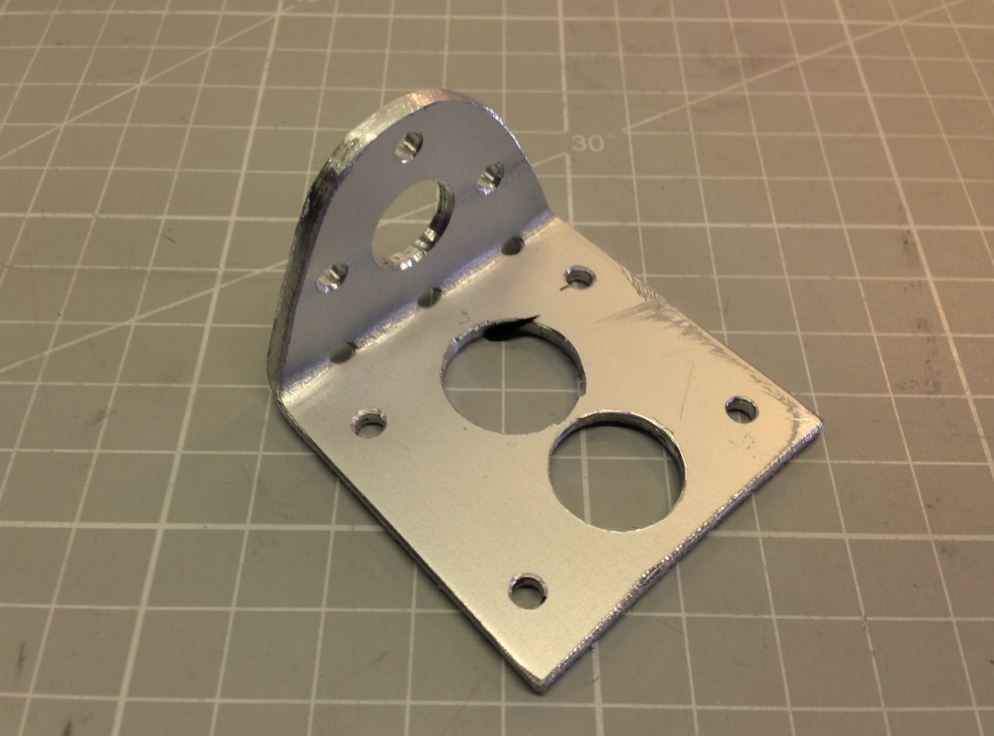

# Bashy

<!-- TOC depthFrom:1 depthTo:6 withLinks:1 updateOnSave:1 orderedList:0 -->

- [Bashy](#bashy)
	- [Overview](#overview)
		- [What why and how](#what-why-and-how)
		- [Electronics](#electronics)
	- [Build](#build)
		- [Cutting to size](#cutting-to-size)
		- [Sparring](#sparring)
		- [Motor mount](#motor-mount)
	- [Pictures](#pictures)
	- [Videos](#videos)

<!-- /TOC -->

## Overview
The bashy is a 1m flying wing that offers good portability and all-around awesomeness.

### What why and how
Vierfuffzig and me were looking for a smaller wing for quite some time, but most were either too small/instable, had too thin profiles or were just too expensive for what they are.

We wanted the profile to be thick enough to be able to put in a decent size battery and carry regular fpv gear including a GoPro without breaking a sweat.

We ended choosing the [Knurrus Maximus FPV from epp-versan.de](http://www.epp-versand.de/a_kmfpv.php). 26 degrees of sweep, 40cm root chord depth and a nice thick profile - also it is rather erfordable :D

### Electronics
We have a set of electronics that have proven to be a good all around setup that also hits cg nicely (which is not completely trivial since you need quite a lot of weight in the front)

- Motor [SK3 2836 1500kv](http://www.hobbyking.com/hobbyking/store/__18157__Turnigy_Aerodrive_SK3_2836_1500_Brushless_Outrunner_Motor.html)
- ESC [40](http://www.hobbyking.com/hobbyking/store/__37947__Hobbyking_YEP_40A_2_6S_SBEC_Brushless_Speed_Controller.html) or [60A Yep](http://www.hobbyking.com/hobbyking/store/__28369__HobbyKing_YEP_60A_2_6S_SBEC_Brushless_Speed_Controller.html) or any other in that range
- [3S 8000mAh 10C Multistar Lipo](http://www.hobbyking.com/hobbyking/store/__56843__Multistar_High_Capacity_6S_8000mAh_Multi_Rotor_Lipo_Pack.html) you can get 6s8Ah Multistar bats and split it into two. [Vierffufzig made a video for carbon showing some of it](https://www.youtube.com/watch?v=J1FEwEMNdAU)
- Prop Any Cam Carbon folding or APC-E 9x5 or 9x6 (9x7 works too but stalls until ~20km/h and needs a 60A ESC)
- Cam [HS1177](http://www.surveilzone.com/DC5V-plastic-case-mini-sony-super-had-ccd-600tvl-super-camera-2.8mm-lens-for-fpv)
- HD Cam: GoPro in case, you will need the weight ;)

## Build

### Cutting to size
For the first few builds we had to cut the 1,40m wing to 1,00m. Now you can just order it and put an info into the comments box to cut it to 1,00m before shipping

Then you have to cut some space for the motor/prop and elevons. The layout should look something like this. CG will be ~18cm from the nose (depending on how exactly you make the cutouts it might move slightly but 18cm should get you started)

### Battery bay
There have been a number of battery mounting solutions, from just a small ply board in the bottom of the bay, a 3d printed one from pla

one cut from glassfibre, with direct mounting for a GoPro

and my current favorite laser cut from ply (it is just done so damn fast, can't be beat in my opinion, but I got no picture at hand)

### Sparring
With spars we have seen  it all. Just two thicker carbon spars on the bottom

to two thick carbon spars on the bottom and a couple thinner glassfibre spars on top and bottom

and everything inbetween.

### Motor mount
Since there is no motor mount included you will have to get your own.
Again, there are a couple options available.
Ones cut from an aluminium L-Square

cut from an aluminim plate and bent

cut from carbon fibre with spar slots

A two piece from aluminum - 3mm base plate and 1.8mm top mount, bent to 90 degrees. CNCed from aluminium.

The sky or your imagination are the limit

### Elevons
EPP Versand does supply thin balsa elevons but we prefer using a bit sturdier ones (balsa, 10mm high, 40mm deep) form them to match your leading edges, taper them on the inside and hinge them.
A easy and solid method is this:

Tape the upper side in place, with the elevon being flush with the leading edge

Flip the elevon up

Attach tape, cut to size and press on firmly

Remove upper tape markers, push elevon down, flush with leading edge and tack down on the bottom using tape again

Attach tape, cut to size and press on firmly

The finished product

### LEDs
Optionally you can add some leds for better visibilty when it's getting dark.

A nice thing to embed are side emitting led strips

If you want to you can add one of those nice flytron strobes. [See it in action](leds.mp4)

### Winglets and skids
For winglets and skids most used are coroplast sheets cut to shape

Laser cut with bashy logo/nick

which can be taped in place while gluing so the attach properly

## Pictures
Some pictures of (mostly) finished builds

## Videos

